## Part 1. Готовый докер

Скачивание офицального докер образа с `nginx` при помощи команды `docker pull`.

`sudo docker pull nginx`

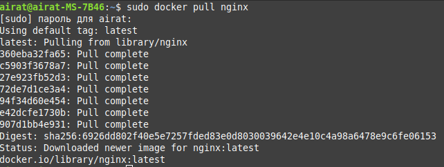

*рис. 1.1 Cкачивание официального докер образа*

Проверка наличия образа:

`sudo docker images`

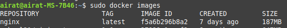

*рис. 1.2 Проверка образа*

Запуск докер образа:

`sudo docker run -d nginx`

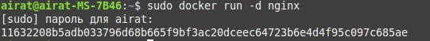

*рис. 1.3 Запуск образа*

Проверка, того что докер запустился:

`sudo docker ps`

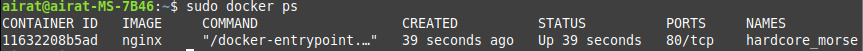

*рис. 1.4 Проверка запуска*

Запись информации о контейнере в файлы (можно ввести первые три символа ID контейнера, в данном случае 116):

`sudo docker inspect 116 > inspect.txt`

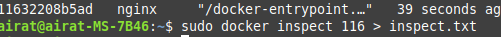

*рис. 1.5 Запись информации о контейнере в файл*

Просмотр файлы через команду cat:

`cat inspect.txt -n`

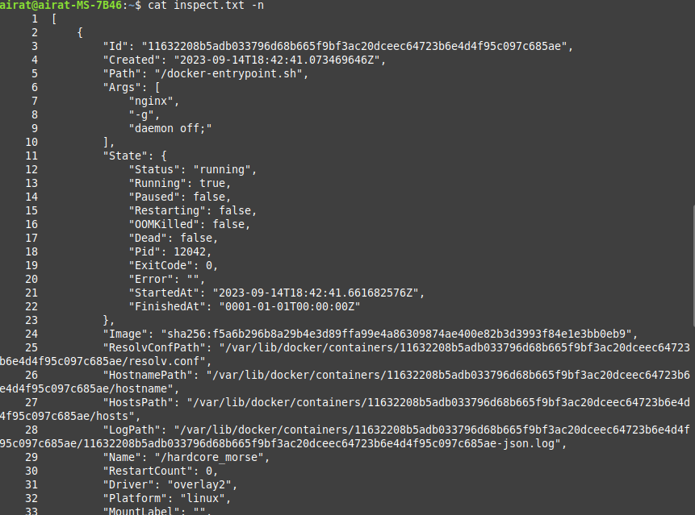

*рис. 1.6 Просмотр информации о контейнере*

Найдем информацию о размере контейнера с помощью команды:

`cat inspect.txt | grep Size -n`

> Размер контейнера: 67108864;

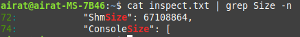

*рис. 1.7 Размер контейнера*

> Список замапленных портов: 80;
> ip контейнера: 172.17.0.2;

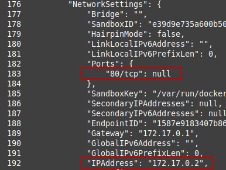

*рис. 1.8 Список замапленных портов и ip контейнера*

Остановка докер образа и проверка того, что образ остановился:

`sudo docker stop 116`

`sudo docker ps`

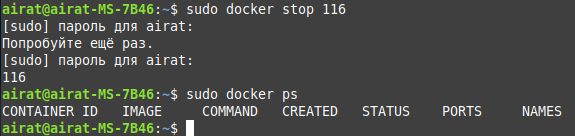

*рис. 1.9 Остановка образа*

Запуск докера с портами 80 и 443, через команду `run`:

`sudo docker run -d -p 80:80 -p 443:443 nginx`

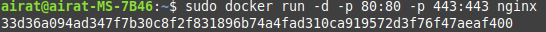

*рис. 1.10 Запуск докера с портами 80 и 443*

Проверка стартовой страницы nginx. Переходим в браузере по адресу localhost:80:

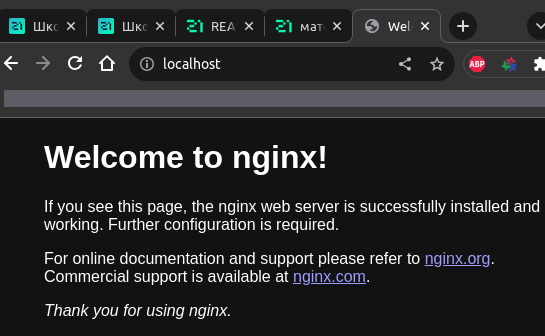

*рис. 1.11 Стартовая стрица nginx*

Перезапуск контейнера и проверка, что он запустился:

`sudo docker restart 33d`

`sudo docker ps`

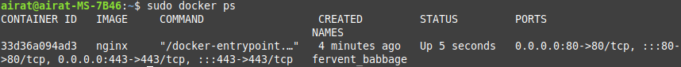

*рис. 1.12 Перезапуск докера*

## Part 2. Операции с контейнером

Прочитать конфигурационный файл nginx.conf внутри докер контейнера через команду exec:

`sudo docker exec 33d cat /etc/nginx/nginx.conf`

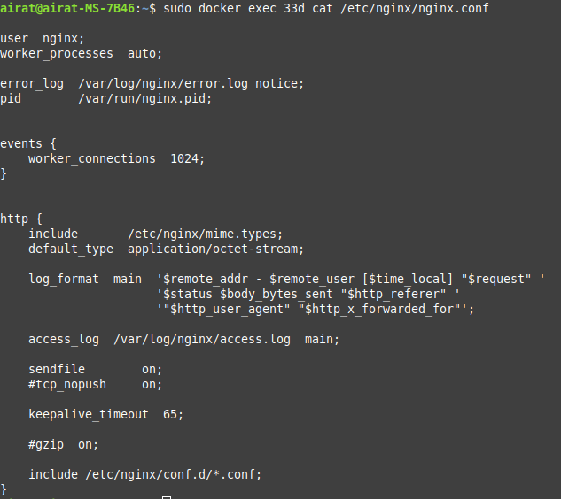

*рис. 2.1 Конфигурационный файл докера*

Создать на локальной машине файл nginx.conf и настроить в нем по пути /status отдачу страницы статуса сервера nginx:

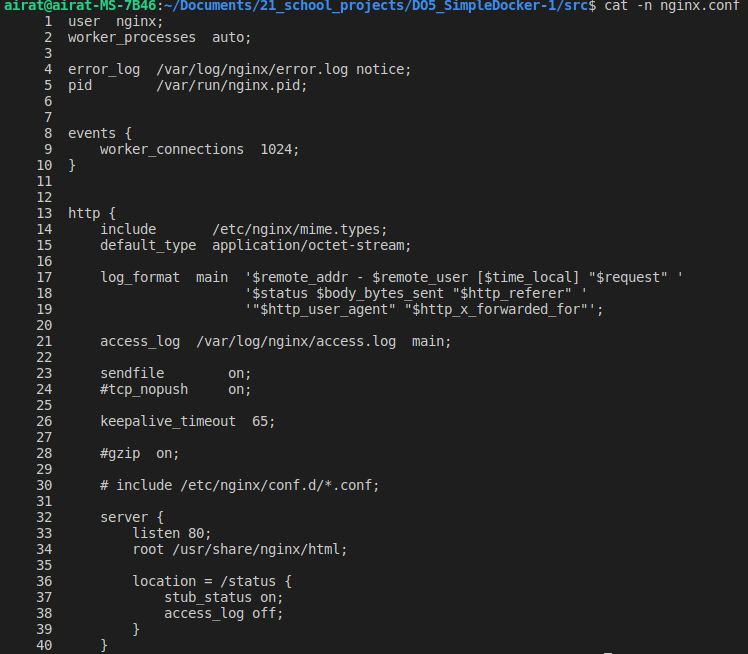

*рис. 2.2 Настройка конфигурационного файла*

Скопировать созданный файл nginx.conf внутрь докер образа через команду docker cp:

`sudo docker cp nginx.conf 33d:/etc/nginx/nginx.conf`

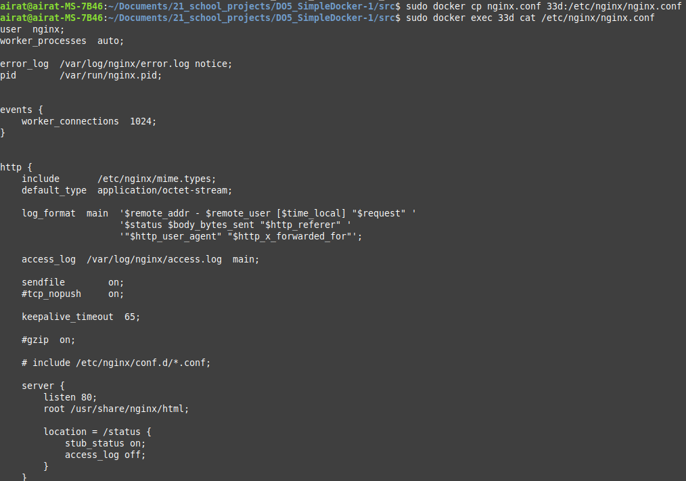

*рис. 2.3 Копирование файла внутрь докер образа*

Перезапустить nginx внутри докер образа через команду exec:

`sudo docker exec -it 33d bash -c "nginx -s reload"`

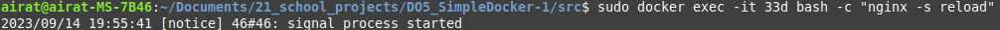

*рис. 2.4 Перезапуск nginx внутри докер образа*

Проверить, что по адресу localhost:80/status отдается страничка со статусом сервера nginx:

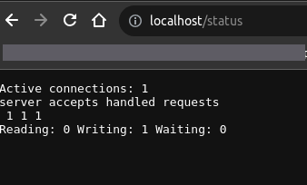

*рис. 2.5 Проверка статуса*

Экспорт контейнера:

`sudo docker export 33d > container.tar`

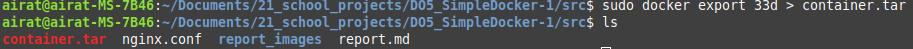

*рис. 2.6 Экспорт контейнера*

Остановка контейнера и удаление образа:

`sudo docker stop 33d`

`sudo docker rmi -f nginx`

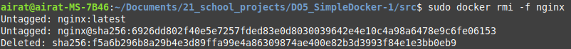

*рис. 2.7 Остановка и удаление*

Удаление остановленного контейнера:

`sudo docker ps -a`

`sudo docker rm -f 33d`

`sudo docker rm -f 116`

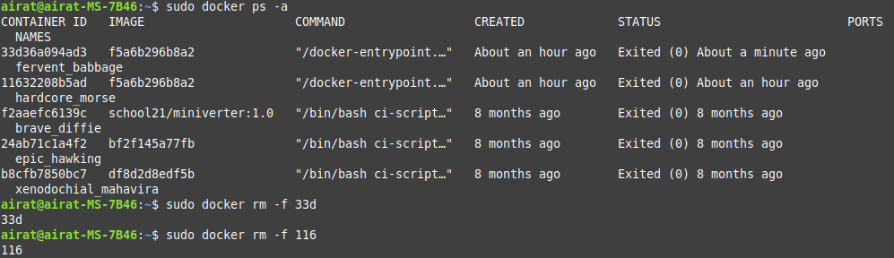

*рис. 2.8 Удаление установленного контейнера*

Импортировать контейнер обратно через команду import, запустить импортированный контейнер:

`sudo docker import -c 'cmd ["nginx", "-g", "daemon off;"]' container.tar nginx`

`sudo docker run -d -p 80:80 -p 443:443 nginx`

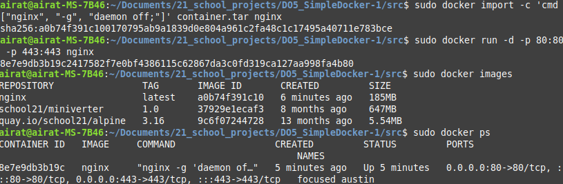

*рис. 2.10 Импорт и запуск контейнера*

Проверить, что по адресу localhost:80/status отдается страничка со статусом сервера nginx:

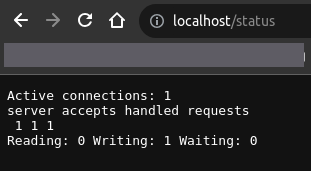

*рис. 2.10 Проверка статуса*

